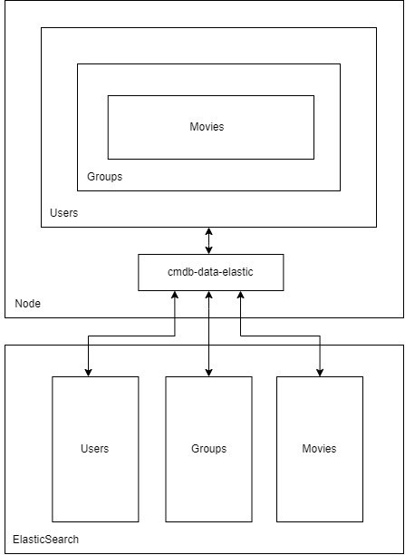

## Introduction to Web Programming

# **Chelas Movies Database (CMDB)**

Nº 49449 Diogo Almeida

Nº 49445 José Alves

Nº 49511 Ricardo Costa

Professor Luís Falcão

Bachelor's Degree in Informatics and Computer Engineering Winter Semester 2022/2023

09/01/2023

<br>

1. **Introduction**

The Chelas Movies Database is a web application developed using the Node.js technology, the Express framework, other multiple libraries and the IMDB API. This application provides a web interface that allows users to search movies by title, get the top rated movies, view movie details and organize them into groups. This report aims to provide an in-depth look at the features and functionality of the CMDB, as well as the technologies and techniques used in its development. Such as HTTP requests and responses.

<br>

2. **Application Structure**

2.1. **Overview**

The CMDB application is structured as a client-server application, with a server component responsible for handling HTTP requests and a client component responsible for presenting a user interface and interacting with the server.

The server component of the CMDB application is organized into several node modules, each responsible for a specific aspect of the application's functionality. The main entry point to the server application is the *cmdb-server.mjs*, which sets up the Express server and defines the routes for the web API. The *cmdb-web-api.mjs* module contains the implementation of the HTTP routes that make up the **REST API** of the web application, including the routes for each of the required features (e.g. get popular movies, search movies, etc.). On the other hand, the *cmdb-web-site.mjs* deals with the website rendering interface, by handling all HTTP requests for the website component of the CMDB application.

The *cmdb-services* module contains the implementation of the logic for each of the application features, including the interaction with the data stored in memory/database and the IMDB API for the movie information; the *cmdb-data-mem* module is responsible for storing and retrieving data in memory in JSON format used to manage the user and group data.; the *cmdb-data-elastic* is also has the same purpose but is performed in an ElasticSearch Database and the *cmdb-movies-data* used to retrieve the movie information for both the search, top movies and specific movie details.

On the client side, the CMDB application uses the HTML format, with Handlebars being responsible for generating dynamic web pages with the information given, the CSS for styling the pages, and some JavaScript for handling additional website functionality. Those allow to show a user interface and interact with the server. The client and server communicate through the web API, with the client making HTTP requests to the server.


**Figure 1** – *Server Application Module Dependencies Diagram*

<br>

2.2. **Web API**

This application provides a **REST API**, through a web interface, which has the following features:

- Get the list of the most popular movies (max 250)
- Search movies by name (max 250)
- Access to the specific movie details: title, image, genre, year, rating, duration, plot, directors, cast, writers and awards
- Manage movies into groups:
- Create a group providing its name and description
- Edit group by changing its name and description
- List all groups
- Delete a group
- Add a movie to a group
- Delete a movie from a group
- Get the details of a group, with its name, description, the names and total duration of the included movies
- User authentication
- Create a new user (sign up)
- Enter as existing user (sign in)
- Exit user session (sign out).

For those operations, the web api provides the following routes:

- **POST** <code>/users</code> - Creates a new user
- **GET** <code>/movies/top</code> - Gets top movies from the IMDB database with 'limit' query
- **GET** <code>/movies/search</code> - Searches movie from the IMDB database with 'q' and 'limit' queries
- **GET** <code>/movies/:movieId</code> - Gets the details of a specific movie
- **GET** <code>/groups</code> - Gets all groups from a user
- **POST** <code>/groups</code> - Creates a group sent in the body
- **GET** <code>/groups/:groupId</code> - Gets a specific group by id from a user
- **PUT** <code>/groups/:groupId</code> - Updates specific group from a user
- **DELETE** <code>/groups/:groupId</code>  Deletes a group from a user
- **POST** <code>/groups/:groupId</code> - Adds a movie to a group
- **DELETE** <code>/groups/:groupId/:movieId</code> - Deletes a movie from a group

<br>

2.3. **Modules**

- **cmdb-server**
Provides the entry point to the server application and configures the express application with the needed modules, configurations and routes.

- **cmdb-web-api**
Implements the HTTP routes from the *cmdb-api-router* that make up the REST API of the web application, while also being responsible for collecting all the data coming from the params, query and body of the HTTP request, and invoking the necessary operations from the *cmdb-services* module to perform the needed task, and also generating and sending the response in JSON format, with the corresponding HTTP status codes.

- **cmdb-web-site**
Implements the HTTP routes from the *cmdb-web-router* that make up the web pages of the site by rendering the web interface and handling all HTTP requests for the website component of the application. This includes obtaining data from requests, invoking the corresponding operation provided by the *cmdb-services* module, generating the response in HTML format, and rendering the response using templates and layout with the corresponding HTTP status codes.

- **cmdb-services**
Responsible for implementing the logic of each of the functionalities of the application, by validating parameters and throwing errors if invalid, invoking operations and returning a result. It provides operations such as creating new users, managing groups and their movies, searching and obtaining movie data. If the operation is related to the user, it will require a user token.

- **cmdb-data-mem**
Allows the program to perform CRUD operations and stores and loads user and group data into and out of memory. The module uses the Node.js crypto module to generate unique tokens for users when they are created and the file-manager module to store the data in a JSON file on the file system. For testing purposes, it also includes a function for changing the file path used to store the data.

- **cmdb-data-elastic**
Similarly to the data-mem module, this module allows the same operations through an ElasticSearch database which stores the user, group and movie documents corresponding to each index through HTTP requests using the fetch module from Node.js.

An ElasticSearch database is organized into indices that contain documents. In this case, the indices are the user, group and movies and each element of those is a document. Each group is related to a specific user, and each movie is related to a specific group. This is accomplished by storing a property of each document with the specific user or group id. In contrast, in the application, the user information is stored in a single JavaScript object, so each user has a property groups and each group has a property movies.

- **cmdb-movies-data**
Responsible for managing requests to the IMDB API using an API key, with operations such as getting the top movies (Top250Movies), searching movies (SearchMovie) and getting movie data (Title).

- **cmdb-api-route & cmdb-web-router**
Implements the HTTP routes and the callback functions to execute when a specific request is made.

- **cmdb-errors**
Implements application-side errors that later are translated by the *http-errors* module.

The following errors are thrown when:

- **INVALID\_PARAMETER:** a parameter does not meet the requirements
- **USER\_NOT\_FOUND:** a user is not found in the database
- **GROUP\_NOT\_FOUND:** a group is not found in the database
- **MOVIE\_NOT\_FOUND:** a movie is not found in the database
- **MOVIE\_ALREADY\_EXISTS:** a movie already exists in a group while trying to add it
- **DB\_ERROR:** a error in *data-mem*, *data-elastic* or *movies-data* occurs
- **USER\_ALREADY\_EXISTS:** someone tries to create a user with a username that already exists in the database
- **NOT\_SIGNED\_IN:** user tries to perform a user-operation like listing all user groups when not signed in
- **INVALID\_CREDENTIALS:** a user tries to login with invalid username or password.

<br>

2.4. **Mapping Elasticsearch JSON Documents to JavaScript Objects**

The mapping between the JavaScript objects in the application and the JSON documents stored in ElasticSearch database is done through the process of serialization and deserialization in the *cmdb-data-elastic* module. The JavaScript objects are serialized into JSON format before being stored in Elasticsearch, given additional ElasticSearch’s default properties like \_id, \_index and \_score. When retrieving the data back from Elasticsearch, the JSON documents are deserialized back into JavaScript objects from the \_source property in order to get the needed properties for the application.

In the user and groups indices, the default \_id from the ElasticSearch’s database is used as the id of the application, since it is unique. On the other hand, the id for the movies corresponds to the id of the IMDb since it is also unique and is useful for getting the movie data when needed.



**Figure 2** – *Mapping between ElasticSearch and Application Diagram*

<br>

3. **Running Application and Tests**

To run the application, you will need to install Node.js and install and run ElasticSearch (or change the default database in the *cmdb-server* to dataMem) on your machine.

Then, in the command line, you can:

- Install all the required dependencies using the following command:
```
npm install
```

- Use this command to start the server, using:
```
npm start
```

- Run all tests, using:
```
npm test
```

- Run the unit tests regarding the *cmdb-services* module, using:|
```
npm run test-services
```

- Run the integration tests, regarding the *cmdb-web-api* module, using:
```
npm run test-api
```

4. **Conclusion**

In conclusion, this report has provided an overview of the structure and implementation of the CMDB web application. It has described the main components of the application, including all the modules, and how they interact with each other. Additionally, it has outlined the main features of the application, including the ability to search, view movies, create and manage groups and add and delete movies from them.

5. **References**

1. ISEL-LEIC-IPW-LEIC31D-A1. GitHub. (n.d.). Retrieved January 9th, 2023, from <https://github.com/isel-leic-ipw/2223i-IPW-LEIC31D/wiki/IPW_IP-2223-1-A1>
1. ISEL-LEIC-IPW-LEIC31D-A2. GitHub. (n.d.). Retrieved January 9th, 2023, from <https://github.com/isel-leic-ipw/2223i-IPW-LEIC31D/wiki/IPW_IP-2223-1-A2>
1. ISEL-LEIC-IPW-LEIC31D-A3. GitHub. (n.d.). Retrieved January 9th, 2023, from <https://github.com/isel-leic-ipw/2223i-IPW-LEIC31D/wiki/IPW_IP-2223-1-A3>
1. ISEL-LEIC-IPW-LEIC31D-A4. GitHub. (n.d.). Retrieved January 9th, 2023, from <https://github.com/isel-leic-ipw/2223i-IPW-LEIC31D/wiki/IPW_IP-2223-1-A4>
1. Internet Movies Database (IMDb). (n.d.). Retrieved January 9th 2023, from <https://imdb-api.com>
1. Handlebars. (n.d.). Retrieved January 9th, 2023, from <https://handlebarsjs.com/api-reference/>
1. Free and open search: The creators of Elasticsearch, Elk & Kibana. Elastic. (n.d.). Retrieved January 9th, 2023, from <https://www.elastic.co/>
1. Documentation. Swagger Documentation. (n.d.). Retrieved January 9th, 2023, from <https://swagger.io/docs/>
11
